# Project 2: Amazon & Netflix Film & TV Show Titles
DAV Module 13 - Project 2 Group Challenge: ETL

## Background 

<!-- 

√ Proposal cites at least two sources of data
√ Proposal includes the type of final production database to load the data into (relational or non-relational)
√ Gives relevant and succinct description of findings (2–3 sentences)

-->

The aim of our project is to...
<!-- uncover patterns in credit card fraud. We’ll examine relationships between transaction types and location, purchase prices and times of day, purchase trends over the course of a year, and other related relationships derived from the data. -->
uncover patterns in Netflix and Amazon releases. We'll examine the relationships between show/movie types, location, quantity and directors over the release years of contents uploaded, and other related relationships derived from the data.

Using relational database (pgAdmin) we hope find correlation in the following topics:
1. compare the number of released titles each year
2. compare the number of released categories each year
3. compare the most active directors
4. compare the number country releases per year

## Sources:

We looked at [Kaggle Datasets](https://www.kaggle.com/datasets/) and sourced 2 csv files of interest to the group:
* [Netflix Shows](https://www.kaggle.com/datasets/shivamb/netflix-shows)
* [Amazon Prime Movies & TV Shows](https://www.kaggle.com/datasets/shivamb/amazon-prime-movies-and-tv-shows)

<!-- 

√ Extract: indicates the original data sources and how the data were formatted at a professional level
√ Transform: explains what data clearing or transformation was required at a professional level
√ Load: explains the final database, tables/collections, and why the topic was chosen at a professional level 

-->

## Extraction

Looking at the general contents of each original dataset against the topics of analysis, we were able to see which columns were valuable to conduct our analysis, and which we were able to discard. Here are samples of the original datasets we had sourced:

* Netflix original df with 12 columns

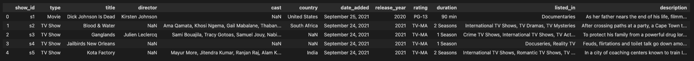

* Amazon original df with 12 columns

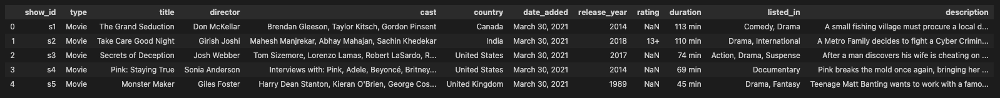

## Transform

Having looked at the topics of analysis, we cleaned the datasets and discarded the unwanted columns that we wouldn't use.

For both datasets, we:
1. imported csv files into Jupyter Notebook to clean
2. renamed some column names to show data significance
3. extract columns required, discarded unwanted columns
4. convert string into list strings
5. explode rows into multiples rows for category column

Hree are samples of the cleaned datasets after cleaning:

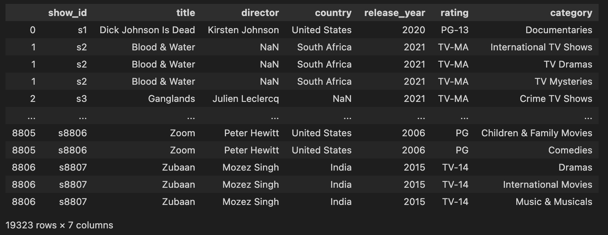
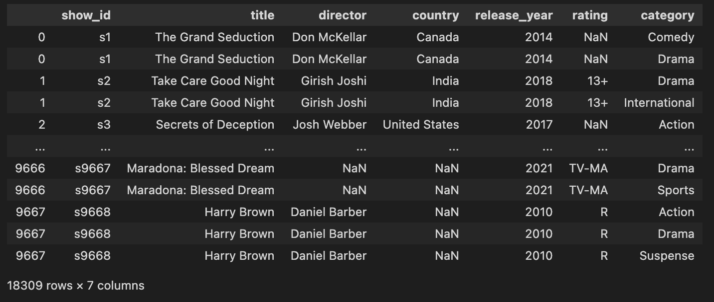

## Load

### SQL Query

For this project, it was used **Postgres** as SQL database.
​
The first step to setup a new SQL database in **Postgres**, we used **PgAdmin** to create a new database named `Project2-db`.

#### Table Schema
Table Schema was created based in the information and data available for each existing columns in the CSV files `amazon_prime_titles.csv` and `netflix_titles.csv`.
​
Both **Amazon Prime** and **Netflix** CSV files provide information in 12 different fields. However, only the fields with relevant data were imported into the **Postgres** database.
​
For both `Amazon` and `Netflix` tables, the field `id` was created to implement a primary key for each one of these tables using `id serial as primary key` to link the 2 tables together.
​
#### Netflix Titles
​
The following SQL script can be used to create the table schema for `Netflix` table:

​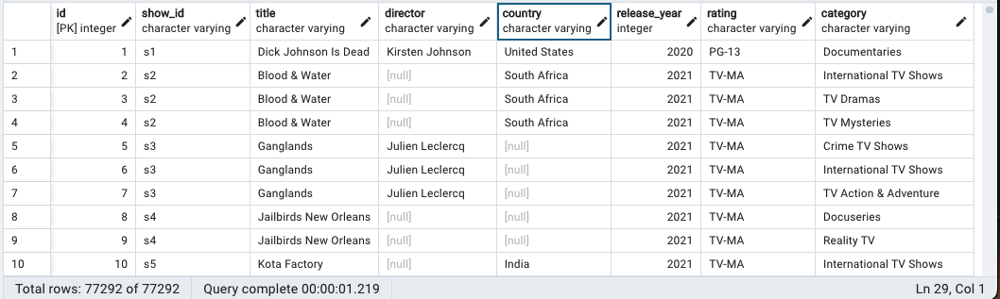

#### Amazon Prime Titles
​
The following SQL script can be used to create the table schema for `Amazon` table:

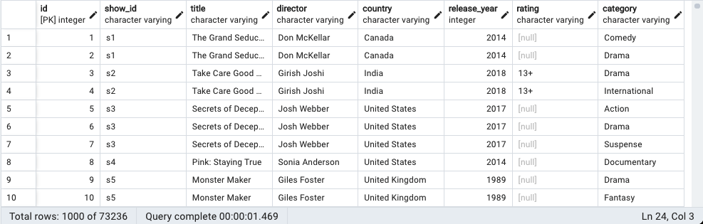​
​
### Importing Data to SQL Database
​
A script in Python using Pandas was written to import the data into the Postgres database tables. This process was executed after the data cleanup and transform the DataFrame.
​

## Queries
​
The following queries were implemented to extract data from Postgres SQL database:
​
1. Checking the data was imported successfully

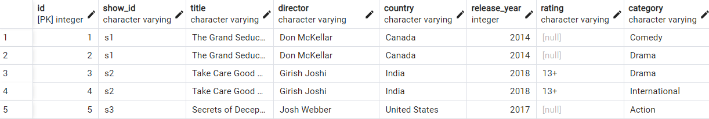
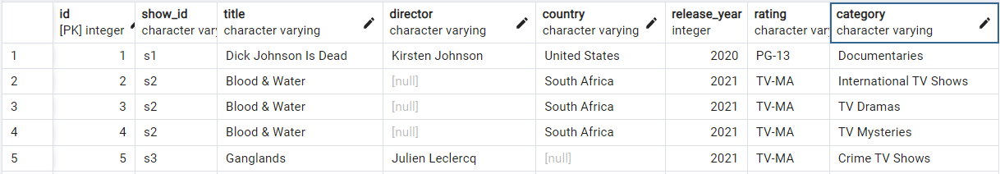
​
2. Listing the movies released before 2017 in Netflix

​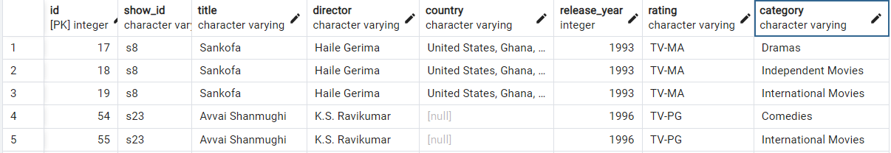

3. Listing the movies that are present in both Netflix and Amazon Prime:

​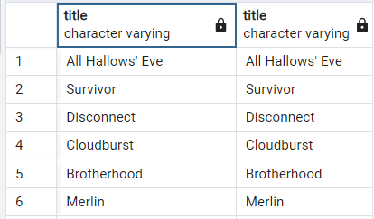​
​
4. Listing the movies that are exclusively to Netflix

​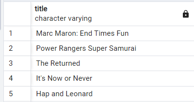

### Pandas & Matplotlib

To produce some visual representation of the data we have looked at, we created some graphs by querything the DataFrames.

#### 1. compare the number of released titles each year

A Pandas DataFrame was created for each platform's `release_year` and `title count` to compare the quantity of titles each platform was uploading for showing. 

This graph illustrates the number of show titles released by Netflix and Amazon Prime and the title's release years. Both competitors movie/show streaming platforms have been equated but in the last 2 years amazon prime surpassed Netflix, providing significantly larger amount of more recent titles. 

We found that Amazon continues to release newer shows and movies, than Netflix does. Netflix has been releasing older content.

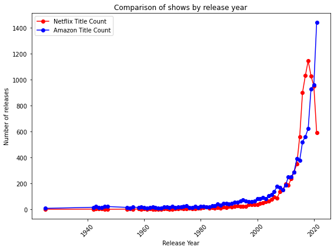

#### 2. compare the number of released categories each year

Categories was tricky to compare across both platforms, since both had their own versions of `category` names, so we had to clean the data by merging and grouping these generic categories together. Then filtering to show the most popular category genres released.

Individually looking at the top 5 categories:

Netflix shows it's top category for releases in `International Movies` with a total of 2,624 titles, to `Documentaries` with 829 titles.

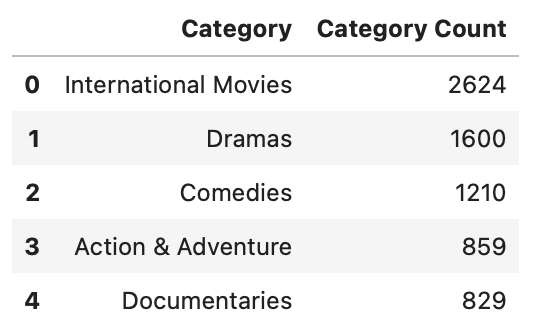

Amazon shows it's top category for releases in `Drama` with 2,216 titles, to `Suspense` with 1,307 titles.

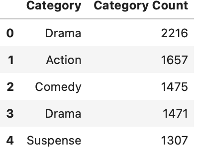

After joining the two datasets we saw that there were categories of similarity listed under separate platforms, like Netflix: `Anime Features` and Amazon: `Anime`, `Animation`. But these could all be grouped together as `Animation`.

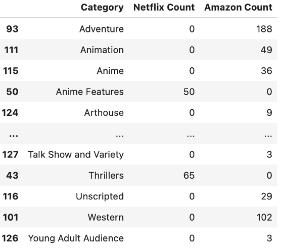

Having cleaned the merged datasets by grouping categories generically together, we were able to condense the number of categories for comparison. The new dataframe sorted alphabetically, now shows 23 categories as opposed to previously 129 categories. 

This filtered dataframe shows either platforms with over 1,000 shows/movies.

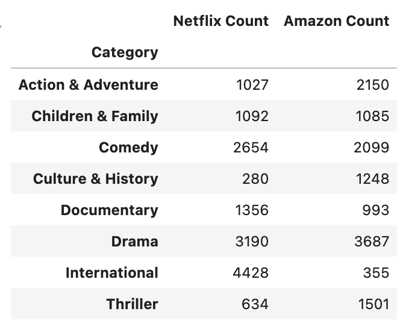

We found that Netflix has a high quantity of International (non-English) content than Amazon does. The all-rounder most popular content released across both platforms is Drama.

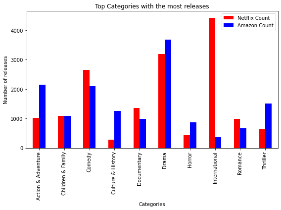

#### 3. compare the most active directors

To compare the most active directors released across each platform, we filtered out the directors with less than 10 recurrences first, then kept only the top 10 directors of each platform. 

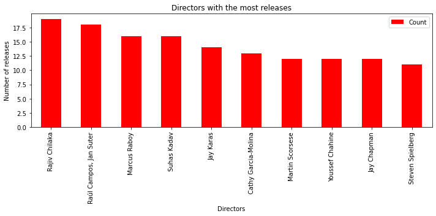
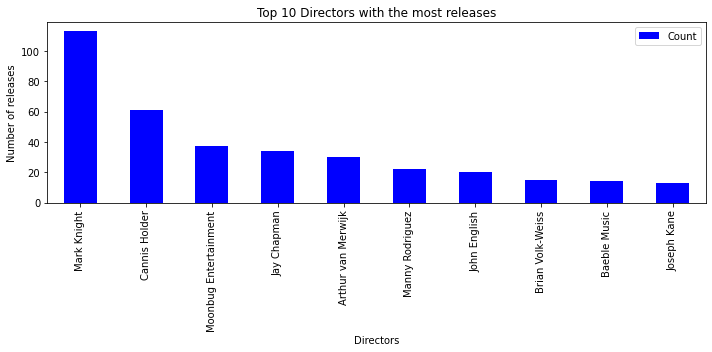

We decided to merge the dataframes and display the most active directors in comparison across the platforms. The analysis shows that although most directors didn't overlap in platform, there was one most recurring director that has shows/movies released on both platforms `Jay Chapman`.
Also, the data shows that Amazon tended to release content of the same director more than Netflix.

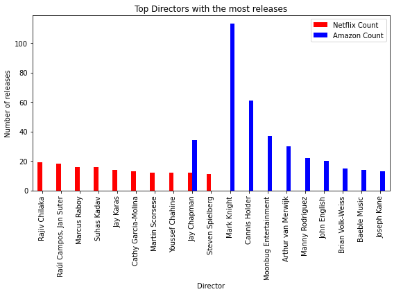

#### 4. compare the number country releases per year

To compare the platforms for their releases by country required cleaning the data by separating each country from the combined fields of each title. It  was tricky, since each listing had all countries duplicated with a space after exploding the rows, e.g. ` United Kingdom`.

We can see here that Netflix releases an incredibly high number of shows and movies from United States as opposed to any other country.
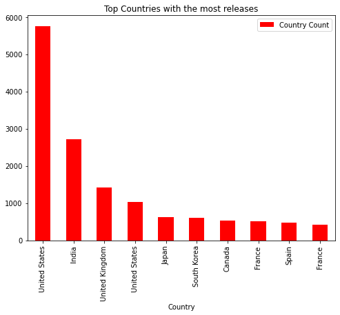

We can see from this graph that similarly with Netflix, Amazon too releases from their top 3 countries of `United States`, `India` and `United Kingdom`

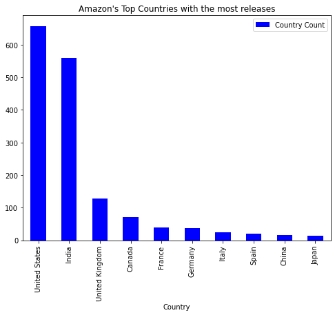

Combining the two bar charts together shows that Netflix has 10x more releases than Netflix in comparison.

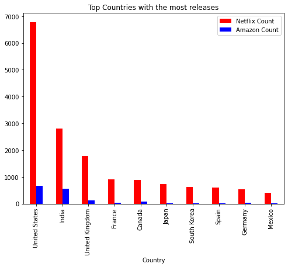

<!--

√ Successfully uploaded to GitHub; demonstrating professional quality of presentation
√ GitHub repository is free of unnecessary files and folders and has an appropriate .gitignore in use
√ The README is customized to a professional level

 -->

[Project 2 Rubric](https://docs.google.com/document/d/1-sJWb5pq3OeFBPAZ_IDXR9LJvY7PoCUickgjTsPVnWo/edit)

- - -

 Team - Group 4 (5)

* Anderson Safo (SAFO99)
* Cheila Bergamini (cheibergam)
* Grace Cheuk (gw-sc)
* Lionnel Tembu (Tembspapi)
* Navindeep Bains (navinbains)
