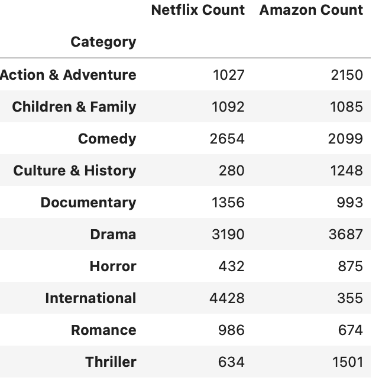

# Project 2: Amazon & Netflix Film & TV Show Titles
DAV Module 13 - Project 2 Group Challenge: ETL

## Background 

<!-- 

√ Proposal cites at least two sources of data
√ Proposal includes the type of final production database to load the data into (relational or non-relational)
√ Gives relevant and succinct description of findings (2–3 sentences)

-->

The aim of our project is to...
<!-- uncover patterns in credit card fraud. We’ll examine relationships between transaction types and location, purchase prices and times of day, purchase trends over the course of a year, and other related relationships derived from the data. -->
uncover patterns in Netflix and Amazon releases. We'll examine the relationships between show/movie types, location, quantity and directors over the release years of contents uploaded, and other related relationships derived from the data.

Using relational database (pgAdmin) we hope find correlation in the following topics:
1. compare the number of released titles each year
2. compare the number of released categories each year
3. compare the most active directors
4. compare the number country releases per year

## Sources:

We looked at [Kaggle Datasets](https://www.kaggle.com/datasets/) and sourced 2 csv files of interest to the group:
* [Netflix Shows](https://www.kaggle.com/datasets/shivamb/netflix-shows)
* [Amazon Prime Movies & TV Shows](https://www.kaggle.com/datasets/shivamb/amazon-prime-movies-and-tv-shows)

<!-- 

√ Extract: indicates the original data sources and how the data were formatted at a professional level
√ Transform: explains what data clearing or transformation was required at a professional level
√ Load: explains the final database, tables/collections, and why the topic was chosen at a professional level 

-->

## Extraction

Looking at the general contents of each original dataset against the topics of analysis, we were able to see which columns were valuable to conduct our analysis, and which we were able to discard. Here are samples of the original datasets we had sourced:

* Netflix original df with 12 columns

* Amazon original df with 12 columns

## Transform

Having looked at the topics of analysis, we cleaned the datasets and discarded the unwanted columns that we wouldn't use.

For both datasets, we:
1. imported csv files into Jupyter Notebook to clean
2. renamed some column names to show data significance
3. extract columns required, discarded unwanted columns
4. convert string into list strings
5. explode rows into multiples rows for category column

Hree are samples of the cleaned datasets after cleaning:

## Load

* final db load, used pgAdmin relational db
* created Project2-db
* created 2 tables - amazon, netflix
    * with `id serial as primary key` to link the 2 tables together
* loaded data from Pandas to sql

### SQL Query

* SQL queries
* insert screenshots of cleaned df and graphs

### Pandas & Matplotlib

To produce some visual representation of the data we have looked at we created some graphs by querything the DataFrames.

#### 1. compare the number of released titles each year

A Pandas DataFrame was created for each platform's `release_year` and `title count` to compare the quantity of titles each platform was uploading for showing. 

We found that Amazon continues to release newer shows and movies, than Netflix does. Netflix has been releasing older content.

#### 2. compare the number of released categories each year

Categories was tricky to compare across both platforms, since both had their own versions of category names, so we had to clean the data by merging and grouping these generic categories together. Then filtering to show the most popular category genres released.

Individually looking at the top 5 categories:

Netflix shows it's top category for releases in `International Movies` with a total of 2,624 titles, to `Documentaries` with 829 titles.

Amazon shows it's top category for releases in `Drama` with 2,216 titles, to `Suspense` with 1,307 titles.

After joining the two datasets we saw that there were categories of similarity listed under separate platforms, like Netflix: `Anime Features` and Amazon: `Anime`, `Animation`. But these could all be grouped together as `Animation`.

Having cleaned the merged datasets by grouping categories generically together, we were able to condense the number of categories for comparison. The new dataframe sorted alphabetically, now shows 23 categories as opposed to previously 129 categories.

We found that Netflix has a high quantity of International (non-English) content than Amazon does. The all-rounder most popular content released across both platforms is Drama.

#### 3. compare the most active directors

To compare the most active directors released across each platform, we filtered out directors with less than 10 recurrences first, then kept only the top 10 directors of each platform. 

We decided to merge the dataframes and display the most active directors in comparison across the platforms. The analysis shows that although most directors didn't overlap in platform, there was one most recurring director that has shows/movies released on both platforms `Jay Chapman`.
Also, the data shows that Amazon tended to release content of the same director more than Netflix.

#### 4. compare the number country releases per year

<!--

√ Successfully uploaded to GitHub; demonstrating professional quality of presentation
√ GitHub repository is free of unnecessary files and folders and has an appropriate .gitignore in use
√ The README is customized to a professional level

 -->

[Project 2 Rubric](https://docs.google.com/document/d/1-sJWb5pq3OeFBPAZ_IDXR9LJvY7PoCUickgjTsPVnWo/edit)

- - -

 Team - Group 4 (5)

* Anderson Safo (SAFO99)
* Cheila Bergamini (cheibergam)
* Grace Cheuk (gw-sc)
* Lionnel Tembu (Tembspapi)
* Navindeep Bains (navinbains)
